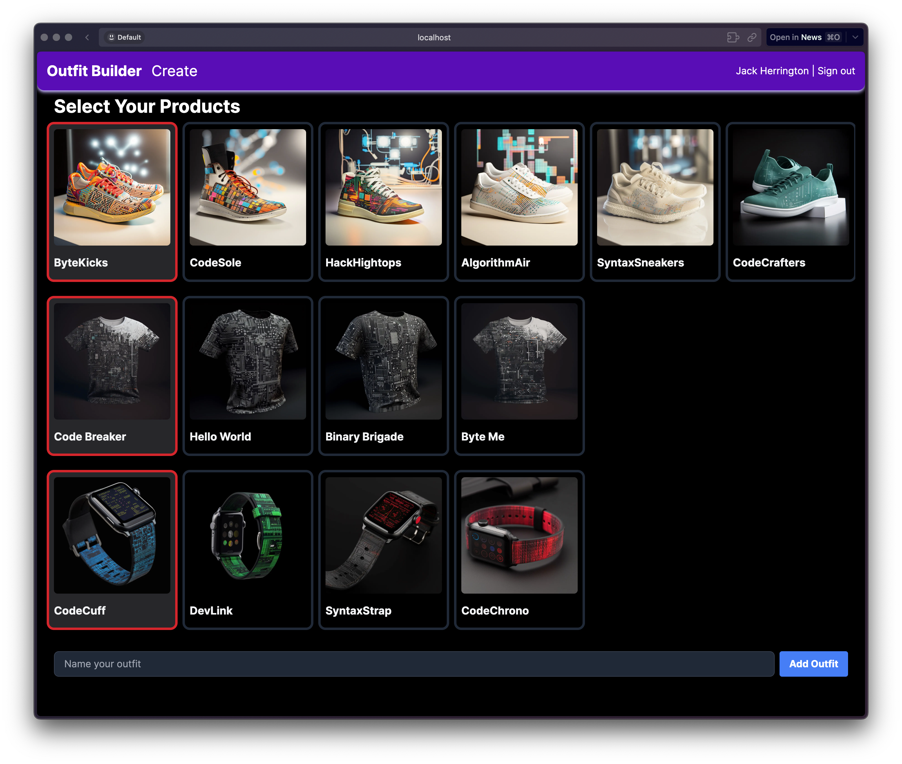

Convex "Outfit Builder" demo application.

## Demo goals

This demonstration application is intended to show off the following features of Convex:

- Typed schemas that have multiple tables with a one-to-many array based relationship
- Cloud deployment
- Cloud functions
- Cloud internal functions
- Integration with Clerk for authentication
- NextJS RSC queries
- Client side mutations and live updates

## Setup

Initialize the `.env.local`:

```
# Deployment used by `npx convex dev`
CONVEX_DEPLOYMENT=********** # convex development deployment key

NEXT_PUBLIC_CONVEX_URL=********** # convex development deployment cloud url
NEXT_PUBLIC_CONVEX_SITE_URL=********* # convex development deployment site url

NEXT_PUBLIC_CLERK_PUBLISHABLE_KEY=********** # Clerk publishable key
CLERK_SECRET_KEY=********* # Clerk secret key
```

Install:

```bash
npm i
```

In one terminal:

```bash
npx convex dev
```

In another terminal:

```bash
npm run dev
```

To seed the product inventory:

```bash
node scripts/seed.js
```

## Screenshots



